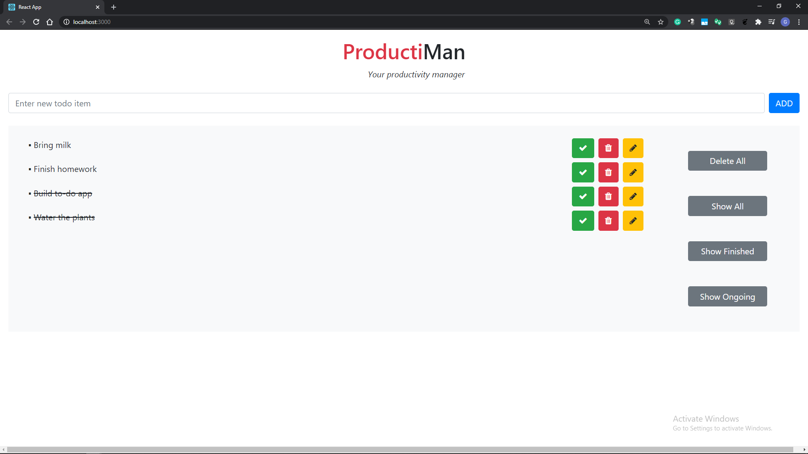

<h1>ProductiMan</h1>
 
A to-do application created in ReactJs which allows the user to:
<ul>
  <li> add a task </li>
  <li> delete a task </li>
  <li> mark a completed task </li>
  <li> delete all tasks </li>
</ul>
  
The application also allows the user to view finished and unfinished tasks separately

